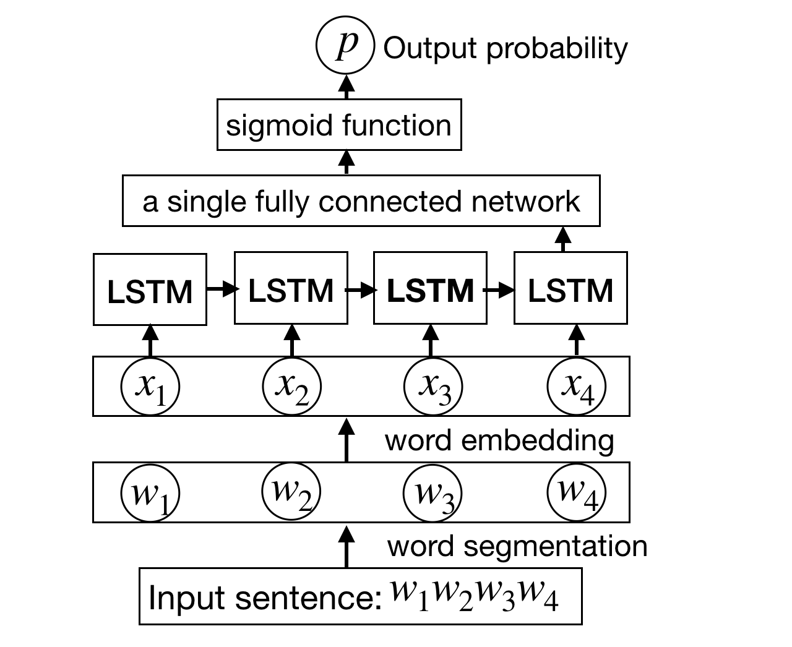

# Task description
Train two classifiers to identify whether the sentence content contains nationalism or populism.

# Use
1. Clone this project 
2. Installation dependencies, pytorch needs to be installed correctly, and the program is running on the GPU.
3. Modify the configuration file, train or test the model. `python main.py`


# Project Structure
```
.
├── config.py # config file
├── data
│   ├── cleanData.py # data clean script
│   ├── nationalism # nationalism dataset 
│   │   ├── dev_clean.csv
│   │   ├── dev.txt
│   │   ├── test_clean.csv
│   │   ├── test.csv
│   │   ├── train_clean.csv
│   │   └── train.txt
│   ├── populism # populism dataset 
│   │   ├── dev_clean.csv
│   │   ├── dev.txt
│   │   ├── test_clean.csv
│   │   ├── test.csv
│   │   ├── train_clean.csv
│   │   └── train.txt
│   └── sourceData
│       ├── test.xlsx
├── loadData.py # load data script
├── main.py # program entry
├── model # model 
│   ├── __init__.py
│   ├── LSTM.py # LSTM model
│   └── RNN.py # RNN model
├── predictionResults # result of prediction
│   ├── nationalism_prediction_result.xlsx 
│   └── populism_prediction_result.xlsx
├── readme.md 
├── screenshot
│   └── model.png
└── trainedModel # has trained best model
    ├── best_nationalism_model.pkl
    └── best_populism_model.pkl
```

# DataSet

We captured the microblog data of the GM topic and manually labeled the data with nationalist sentiment or populism and these data are used as positive samples.

At the same time, we captured the microblog data of the media. 
These data are relatively objective and do not include the above two types mood. So these data are used as negative samples.
## Data Sample

Taking the nationalist data set as an example, the training set/verification set data format is as follows:

`1#跟着感觉走#“这小子就是个汉奸买办，他在一直在华夏鼓吹转基因食品是无害的，也没见他吃过一次！” 秒拍视频 `

Translated into English above is:

`"1#Follow the feeling#This kid is a traitor comprador. He has been ignoring genetically modified food in China, and he has never seen him eat it once!"
`

So the first digit is the label, 1 indicates nationalist sentiment, 0 means no, followed by text content and there is no correct label in the test set.

## DataSet Size
We divided the data set into training and verification sets according to 8:2.

Test data of the two classifiers is the same.

### Nationalism

| DataSet | Positive | Negative | Total|
| :------:| :------:  | :------:  |:---:|
|Train|30458|31940|62398|
| Validation |7541|8059|15600|
|Test| -| -|19458|

### Populism

| DataSet | Positive | Negative | Total|
| :------:| :------:  | :------:  |:---:|
|Train|26457|31942|58399|
| Validation |6543|8057|14600|
|Test| -| -|19458|


# Model
Take nationalism as an example.



1. Word segmentation of the input sentence
2. Convert each word after the word segmentation into a word vector
3. Enter the sentence into the LSTM loop neural network to obtain the last hidden layer node of the network. This node can be regarded as a deep representation of the entire sentence.
4. Send this representation into a fully-joined single-layer neural network and pass the sigmoid function to obtain p. This p is the probability that this sentence is nationalistic.


# Experiments

Model hyper-parameter:

| Vocabulary Size | Batch Size |Word embedding|LSTM Hidden|Learning rate|Optimization|
| :---: | :---: |:---:|:---:| :---:|:---:| 
|10000| 32|100|256|0.01|Adam|

We train and test the model using the Pytorch framework. 
Specifically, the model is trained on the training set, and the accuracy of the current classifier is verified on the validation set every 100 batches. 
Save the model parameters with the highest accuracy on the validation set and use this model to make predictions on the test set.

## Result

- nationalism

| DataSet | Accuracy | Precision| Recall| F-value|
| :---: | :---: |:---:|:---:| :---:|
| Train | 0.9375 |0.9444|0.9444|0.4722|
| Validation | 0.9242 |0.8592|0.9453|0.4467|


- populism

| DataSet | Accuracy | Precision| Recall| F-value|
| :---: | :---: |:---:|:---:| :---:|
| Train | 0.9062 |0.9286|0.8667|0.4483|
| Validation | 0.8521 |0.7579|0.7951|0.3808|


# Cite

If this dataset and code is applied to your work, please quote the following article:

**《The Expression of Nationalist and Populist Emotions: A Study Based on the GMO Issues on Sina Weibo》**

